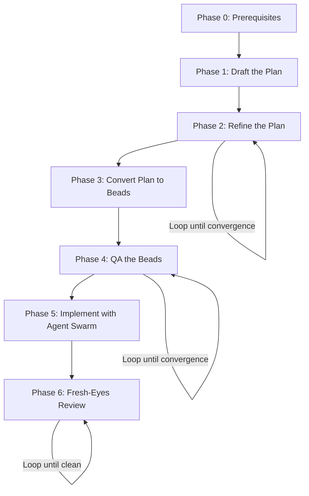

# The Flywheel Planning Playbook

A step-by-step operational guide for planning and executing software projects with coding agents.

Based on [Jeffrey Emanuel's](https://jeffreyemanuel.com/) ([@doodlestein](https://x.com/doodlestein)) agentic coding methodology and the [Agentic Coding Flywheel](https://agent-flywheel.com/). Prompt library derived from [jeffreysprompts.com](https://jeffreysprompts.com/). Playbook derived from @voidserf's guide [World-Class Planning With Agent Flywheel](https://x.com/voidserf/status/2018016937834631390).

---

## The Core Idea

**Spend planning tokens to save implementation tokens.** Reach a steady-state plan where remaining improvements are incremental, then unleash agents.

Planning is the highest-leverage activity in agent-driven development. A well-refined plan with proper task decomposition lets a swarm of agents execute in parallel without stepping on each other, missing requirements, or building the wrong thing.

## The Workflow

Each phase has a **goal**, **steps**, **copy-paste prompts**, and a **stop condition** that tells you when to move on.

!!! warning "Do not skip phases"
    Do not start implementation before your plan and beads stabilize. The whole point is front-loading the thinking.

## What Makes This Different

Most developers jump straight to code. This playbook inverts the ratio:

| Activity | Typical | Flywheel |
|----------|---------|----------|
| Planning | ~10% of effort | **~85% of effort** |
| Implementation | ~70% of effort | ~10% of effort |
| Review/Fix | ~20% of effort | ~5% of effort |

The result: agents produce better code faster because they're working from a plan that has already been stress-tested through multiple critique rounds.

## Getting Started

1. Read the [Principles](playbook/principles.md) to understand the "why"
2. Walk through each phase starting with [Phase 0](playbook/phase-0-prerequisites.md)
3. Use the [Prompt Pack](playbook/prompt-pack.md) for ready-to-paste templates
4. Keep the [Quick Reference](playbook/quick-reference.md) card handy

## Sources

- [Jeffrey Emanuel's Agentic Coding Flywheel](https://agent-flywheel.com/)
- [Agentic Coding Flywheel Setup (GitHub)](https://github.com/Dicklesworthstone/agentic_coding_flywheel_setup)
- [@doodlestein on X](https://x.com/doodlestein)
- [@voidserf's prompt guide](https://x.com/voidserf/status/2018016937834631390)
- [jeffreysprompts.com](https://jeffreysprompts.com/)
