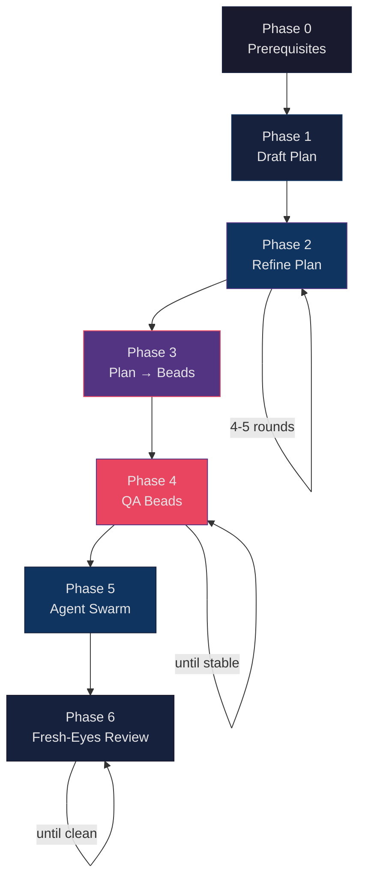

# Quick Reference

## Stop Conditions

Know when to move on. Each phase has a convergence signal.

| Phase | Move on when... |
|-------|----------------|
| **Phase 0** | All prerequisites are in place |
| **Phase 1** | You have a comprehensive first draft |
| **Phase 2** | Only minor wording tweaks remain; no architectural/test/ops improvements |
| **Phase 3** | All plan sections are represented as beads with dependencies |
| **Phase 4** | Beads changes are mostly reordering/renaming, not missing work |
| **Phase 5** | All beads are implemented and marked complete |
| **Phase 6** | Review passes produce no substantive diffs |

## Plan QA Checklist

Run this as a self-audit at the end of Phase 2, before converting to beads.

- [ ] **Goals:** measurable, user-facing outcomes exist
- [ ] **Non-goals:** explicit, to prevent scope creep
- [ ] **Threat model:** realistic attacker model + mitigations
- [ ] **Secrets:** where they live, how they're injected, what never enters logs
- [ ] **Failure modes:** retries/timeouts/backoff; idempotency rules
- [ ] **Performance:** explicit SLOs; measurement plan
- [ ] **Observability:** structured logs, metrics, traces; alert thresholds
- [ ] **Testing:** unit + integration + e2e; fixtures/logging; "how we debug failures"
- [ ] **Rollout:** feature flags, migrations, rollback steps

## Workflow Diagram

## Key Tools in the Flywheel

| Tool | Purpose |
|------|---------|
| **Beads (bd/br)** | Task management with dependency tracking |
| **Beads Viewer (bv)** | Task prioritization and triage (`--robot-next`, `--robot-triage`) |
| **Agent Mail** | Inter-agent messaging and coordination |
| **NTM** | Named Tmux Manager for multi-agent orchestration |
| **CASS** | Coding Agent Session Search across 11+ agent formats |
| **UBS** | Error detection beyond standard linting |

## Sources

- [Jeffrey Emanuel's Agentic Coding Flywheel](https://agent-flywheel.com/)
- [Flywheel Setup (GitHub)](https://github.com/Dicklesworthstone/agentic_coding_flywheel_setup)
- [@doodlestein on X](https://x.com/doodlestein)
